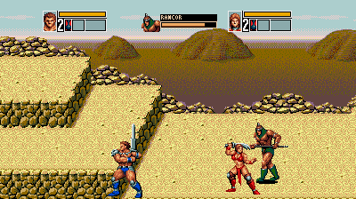
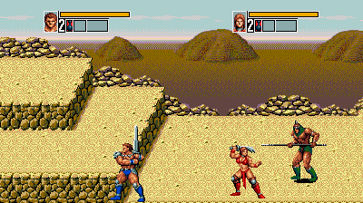
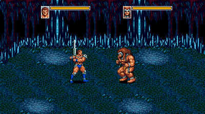

# Golden Axe III — Six-Button Controls & Enemy HUD

An improvement patch for the Japanese Sega Genesis / Mega Drive version of *Golden Axe III*.

## Features

- Configurable six-button controls for both players:
  - X: block
  - Y: round attack
  - Z: character-specific unique move
- Separate ABC and XYZ layouts in the Options menu, with all six assignments available.
- A `3PAD COMBOS` option for the original button combinations. It defaults to OFF and can be enabled for three- or six-button controllers.
- A centered enemy panel showing a native portrait, name, variant, and remaining health.
- Enemy names based on the original manual where available, plus the patch-authored names Rancor and Havoc.
- Player HUD positions that accommodate maximum health; Versus mode keeps the original positions.
- A simpler level-select shortcut: press A+B+C together on controller 1 at character selection.

## Installation

Download `Golden_Axe_III_6Button_EnemyHUD_v1.0.zip` and apply the included IPS patch to your own copy of the exact source ROM listed below. Configure the emulator for a six-button Genesis controller and start the game from a fresh boot.

This repository contains no game ROM.

## Required source ROM

- Filename: `Golden_Axe_III_(J)_[h1].bin`
- Size: 1,048,576 bytes
- CRC32: `65F4D556`
- MD5: `8f3f887d86cca2d586e5e6515121b0df`
- SHA-1: `a602f49de6f006b9cd210049496098dc01a1ca10`
- SHA-256: `04d753b8e24ba7644091eb662f93dfaa4d5124c6c69b31fc5c1682ad68c665f6`

The tested source is an `[h1]` dump rather than a verified clean retail dump. Other dumps and combinations with other hacks have not been tested.

## Controls

The default XYZ layout is Block, Round Attack, and Unique Move. The Options menu can swap these assignments independently of ABC.

The unique move triggers Kain's projectile, Proud's tornadoes, Chronos's lunging attack, or Sarah's sword throw. Normal combat restrictions still apply.

To use level select, press A+B+C together on controller 1 at character selection, choose the stage with Up/Down, and press Start.

## Validation

The patch has been tested in Genesis Plus GX Wide with automated checks for gameplay controls, all Options layouts, on-screen labels, enemy HUD behavior, maximum player health, Versus HUD positions, IPS reconstruction, and the Genesis checksum. Physical hardware and a complete campaign playthrough have not been tested.

## Screenshots

