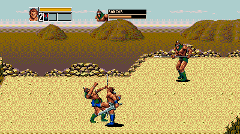
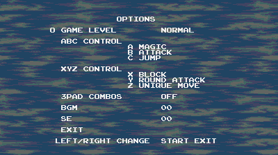

# Golden Axe III - Playable Enemies & Bosses

Play as enemies and bosses in *Golden Axe III*, with configurable six-button controls and an enemy health display.

## Playable bosses and remaining issues

Playable bosses have been fixed as far as possible. **The game has been completed using one of the bosses**, but there is no guarantee that every boss or enemy will work perfectly throughout the game.

Boss palettes can still look wrong in places, and some other characters may show unusual colors when a boss is the player. These are visual issues and are not critical to gameplay.

## Features

- Play as enemies and bosses in single-player.
- Use their attacks and special moves, plus magic borrowed from the original heroes.
- Adjust ABC and XYZ button layouts in Options.
- See the enemy's portrait, name, and remaining health.
- Use the original player health, magic, and lives display.
- Versus keeps its original character selection.

## Download and installation

[Download the playable-enemies patch](Golden_Axe_III_PlayableEnemies.zip).

Apply `Golden_Axe_III_PlayableEnemies.ips` to your own copy of `Golden_Axe_III_(J)_[h1].bin`. Apply it to the original game, not an already patched version. This patch includes the six-button controls and enemy HUD.

The required original file is 1,048,576 bytes, with CRC32 `65F4D556` and SHA-1 `a602f49de6f006b9cd210049496098dc01a1ca10`. Other versions have not been tested. No game ROM is included.

Reopen the patched game and start fresh. Set your emulator's controller to six-button to use X, Y, Z, and Mode.

## Controls

- **Character selection:** Up/Down selects an enemy or boss; Left/Right returns to the original heroes. Press Start to confirm.
- **Original heroes:** X blocks, Y uses the round attack, and Z uses the unique move.
- **Enemies and bosses:** X blocks or evades where supported; Y and Z use character-specific special moves.
- **Magic:** A in the default button layout; requires magic bottles.
- **Options:** change ABC/XYZ layouts or enable the original three-button combinations.
- **Level select:** press A+B+C together at character selection.
- **Clear-screen cheat:** hold Mode and press Start during gameplay or camp. Clears visible enemies and makes dwarfs release their remaining items. Not available in Versus.

## Original controls-only edition

The earlier [six-button controls and enemy HUD edition](Golden_Axe_III_6Button_EnemyHUD_v1.0.zip) is also available without playable enemies or bosses.

